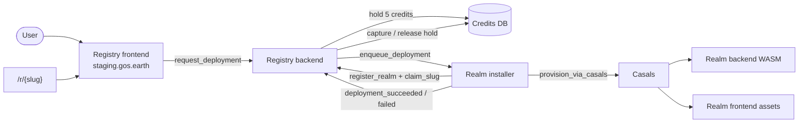

# gos-as-a-service

GOS-as-a-Service (GaaS) is the platform behind [gos.earth](https://gos.earth): an **implementation-agnostic** realm registry and deployment installer. It hosts the create-realm wizard, slug federation portal (`/r/{slug}`), credits billing, and the queue that provisions new realms via Casals.

**Realms GOS** ([smart-social-contracts/realms](https://github.com/smart-social-contracts/realms)) is the first (and currently only) GOS implementation. That repo consumes **prebuilt WASM and frontend tarballs** from this repo's GitHub Releases — it no longer builds registry/installer artifacts itself.

## Architecture

| Component | Path / repo | Role |
|---|---|---|
| Registry backend | `src/realm_registry_backend/` | Credits, slug claims, deployment requests |
| Registry frontend | `src/realm_registry_frontend/` | Create-realm wizard + federation portal at `*.gos.earth` |
| Realm installer | `src/realm_installer/` | Deployment queue, WASM verification, provisioning orchestration |
| File registry | `src/file_registry/` | Platform artifact store — WASM/frontend files of supported GOS implementations, branding assets |
| File registry frontend | `src/file_registry_frontend/` | Static admin UI for the file registry; deployed per-env from release tarballs |
| Casals (external) | [smart-social-contracts/casals](https://github.com/smart-social-contracts/casals) | Platform provisioner — on-chain canister lifecycle orchestrator |

Casals is an **external platform component**, not built from this repo. The realm installer reaches a Casals conductor at runtime via `InstallerConfig` on the installer canister: `casals_canister_id`, `casals_section`, and `provision_via_casals`. Any conforming Casals conductor can serve a network; today the **realms** fleet operates the conductors per network:

| Network | Casals conductor |
|---|---|
| test | `qthgp-3yaaa-aaaae-agveq-cai` |
| demo | `jo3cj-faaaa-aaaac-bffea-cai` |
| staging | `jj2e5-iyaaa-aaaac-bffeq-cai` |

GaaS canister IDs are **unchanged** from the realms era — the same live canisters on test/demo/staging; only build provenance moves to this repository.



1. User completes the wizard on the registry frontend.
2. Frontend calls `request_deployment` on the registry backend with a manifest (GOS implementation, release tag, artifacts).
3. Registry checks credit balance (**5 credits** per deploy), holds credits, and forwards to the installer.
4. Installer enqueues the job; optionally triggers `provision_via_casals` for on-chain stand creation.
5. Off-chain worker (realms-deployer) or the configured Casals conductor completes WASM + asset install.
6. Installer notifies registry via `deployment_succeeded` (capture hold) or `deployment_failed` (release hold).
7. Slug is claimed so the realm is reachable at `{slug}.gos.earth` → `/r/{slug}`.

## DNS-mapped frontend canisters

**`*.gos.earth`** (`staging.gos.earth`, `demo.gos.earth`, `test.gos.earth`) is mapped in DNS and IC custom-domain tables to **`realm_registry_frontend`** — the wizard + federation site.

**`*.realmsgos.org`** is mapped the same way to **`marketplace_frontend`** when that canister is in the environment descriptor.

For both, the canister ID is part of the hostname contract — a deleted ID cannot be reused, so replacing it means new registrar records and a new IC domain registration (hours of downtime).

Other frontends (`casals_frontend`, file-registry UI, realm UIs) are **not** DNS-mapped apex targets. They can be destroyed and recreated.

To rebuild an environment without touching DNS mappings, `gaas` drain-destroys everything else (including other frontends), refunds leftover cycles to the cycles ledger, and **adopts** the existing DNS-mapped frontend IDs:

```bash
gaas new environments/staging.json --identity deployer --network ic --yes \
  --destroy-except-realm-registry-frontend
```

Do not `dfx canister delete` the DNS canisters. See [AGENTS.md](./AGENTS.md#dns-mapped-frontends--why-we-keep-realm_registry_frontend-and-marketplace_frontend) and [docs/GAAS_CLI.md](./docs/GAAS_CLI.md#rebuild-except-realm-registry-frontend---destroy-except-realm-registry-frontend).

## Deploy cost

Each realm deployment costs **5 credits**. Credits are topped up via Stripe (billing service); the registry holds credits at enqueue time and settles when the installer reports success or failure.

## Development quickstart

```bash
# Terminal 1 — local replica
dfx start --background --clean

# Basilisk venv (Python canister builds)
python3 -m venv .venv-basilisk
.venv-basilisk/bin/pip install ic-basilisk==0.14.2 ic-basilisk-toolkit==0.5.3 \
  ic-python-db==0.11.0 ic-python-logging==0.3.4
export PATH="$PWD/.venv-basilisk/bin:$PATH"

# Build backend WASMs
python -m basilisk realm_registry_backend src/realm_registry_backend/main.py
python -m basilisk realm_installer src/realm_installer/main.py

# Deploy backends locally
dfx deploy realm_registry_backend realm_installer

# Frontend
npm install
dfx generate realm_registry_backend
dfx generate realm_installer
npm run build --workspace=realm_registry_frontend
dfx deploy realm_registry_frontend
```

Backend unit tests run **without** a replica:

```bash
pip install -r requirements-dev.txt
python3 -m pytest tests/backend/ -q
```

## Release process

1. Tag `vX.Y.Z` on `main`.
2. `.github/workflows/release.yml` builds:
   - `realm_registry_backend.wasm.gz` + `.did`
   - `realm_installer.wasm.gz` + `.did`
   - `realm_registry_frontend.tar.gz` (dist tarball)
   - `file_registry_frontend.tar.gz` (static admin UI dist tarball)
3. GitHub Release attaches these artifacts plus `checksums.txt`.
4. Release workflow updates `src/realm_registry_frontend/src/lib/config.js` with the tag and WASM checksums.

## Related repositories

| Repository | Role |
|---|---|
| [smart-social-contracts/casals](https://github.com/smart-social-contracts/casals) | Platform provisioner (on-chain canister lifecycle) |
| [smart-social-contracts/realms](https://github.com/smart-social-contracts/realms) | First GOS implementation + fleet operator (Casals conductors per network) |

## Relationship to Realms GOS

The **realms** repo references release artifact URLs in its `dfx.json` / mundus deployment descriptors instead of building registry/installer locally. After a GaaS release:

- Realms pins `deploy_release_tag` and checksums to the new release.
- Realm deployments pull `realm_backend.wasm.gz` and `realm_frontend.tar.gz` from **realms** releases (unchanged).
- Registry/installer artifacts come from **this** repo's releases.

See [docs/GAAS_CLI.md](./docs/GAAS_CLI.md) for the descriptor-driven `gaas` CLI, and [AGENTS.md](./AGENTS.md) for agent-oriented deploy loops, canister IDs, and debugging.
